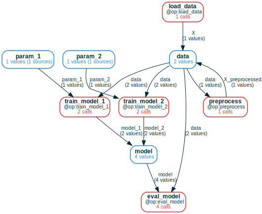

<div align="center">
  <br>
    
  <br>
<a href="#install">Install</a> |
<a href="https://colab.research.google.com/github/amakelov/mandala/blob/master/docs_source/tutorials/01_hello.ipynb"> Quickstart 
   </a> | 
<a href="#tutorials">Tutorials</a> |
<a href="https://amakelov.github.io/mandala/">Docs</a> |
<a href="#blogs">Blogs</a> |
<a href="#testimonials">Testimonials</a> |
</div>

# Automatically save, query & version Python computations
`mandala` eliminates the effort and code overhead of ML experiment tracking (and
beyond) with two versatile tools:

1. The `@op` decorator:
    - **Automatically captures inputs, outputs and code (+dependencies)** of Python function calls
    - Automatically reuses past results & **never computes the same call twice**
    - **Designed to be composed** into end-to-end persisted programs, enabling
    efficient iterative development in plain-Python, without thinking about the
    storage backend.

<table>
  <tr>
    <td>
      <ol start="2">
    <li>
        The <a href="https://amakelov.github.io/mandala/blog/01_cf/">ComputationFrame</a> data structure:
        <ul>
        <li>
            <strong>Automatically organizes executions of imperative code into a high-level computation graph of variables and operations</strong> by detecting patterns like feedback loops, branching/merging and aggregation/indexing
        </li>
        <li>
            <strong>Automatically queries data</strong> by extracting a dataframe where columns are variables and operations in the graph, and each row contains values/calls of a (possibly partial) execution of the graph
        </li>
        <li>
            <strong>Automates exploration, and high-level operations</strong> over heterogeneous "webs" of <code>@op</code> calls
        </li>
        </ul>
    </li>
    </ol>
    </td>
    <td></td>
  </tr>
</table>


# Install
```
pip install git+https://github.com/amakelov/mandala
```

# Tutorials 
- Quickstart: <a href="https://colab.research.google.com/github/amakelov/mandala/blob/master/docs_source/tutorials/01_hello.ipynb"> 
   </a>
- Toy ML project: <a href="https://colab.research.google.com/github/amakelov/mandala/blob/master/docs_source/tutorials/02_ml.ipynb"> 
   </a>

# Blogs
- [Tidy Computations](https://amakelov.github.io/mandala/blog/01_cf/): introduces
the `ComputationFrame` data structure and its applications
- [Practical Dependency Tracking for Python Function
Calls](https://amakelov.github.io/blog/deps/): describes the motivations and designs behind `mandala`'s dependency tracking system
- [Mandala: Python Programs That Save, Query and Version Themselves](https://amakelov.github.io/blog/pl/): Overall summary of previous version. It holds for the current version except for the section titled "Pattern-matching queries"

Also see the [paper](https://amakelov.github.io/scipy-mandala.pdf) which is to
appear in the SciPy 2024 proceedings.

# FAQs

## How is this different from other experiment tracking frameworks?
Compared to popular tools like W&B, MLFlow or Comet, `mandala`:
- **is tightly integrated with the actual Python code execution**, as
opposed to being an external logging framework. This makes it much easier to
compose and iterate on multi-step experiments with non-trivial control flow.
    - For instance, Python's collections can be (if so desired) made
    transparent to the storage system, so that individual elements are
    stored separately and can be reused across collections and calls.
- **is founded on memoization, which allows direct and transparent reuse of
results**. 
    - While in other frameworks you need to come up with arbitrary names
for artifacts (which can later cause confusion)
- **allows reuse, queries and versioning on a more granular and flexible
level** - the function call - as opposed to entire scripts and/or notebooks.
- **provides the `ComputationFrame` data structure**, a much more natural way to
represent and manipulate persisted computations.
- **automatically resolves the version of every `@op`** from the current state
of the codebase.

## How is the `@op` cache invalidated?
- given inputs for a call to an `@op`, e.g. `f`, it searches for a past call
to `f` on inputs with the same contents (as determined by a hash function) where the dependencies accessed by this call (including `f`
itself) have versions compatible with their current state.
- compatibility between versions of a function is decided by the user: you
have the freedom to mark certain changes as compatible with past results.
- internally, `mandala` uses slightly modified `joblib` hashing to compute a
content hash for Python objects. This is practical for many use cases, but
not perfect, as discussed in the "gotchas" notebook TODO.

## Can I change the code of `@op`s, and what happens if I do?
- a frequent use case: you have some `@op` you've been using, then want to
extend its functionality in a way that doesn't invalidate the past results.
The recommended way is to add a new argument `a`, and provide a default
value for it wrapped with `NewArgDefault(x)`. When a value equal to `x` is
passed for this argument, the storage falls back on calls before 

## How self-contained is it?
- `mandala`'s core is simple (only a few kLoCs) and only depends on `pandas`
and `joblib`. 
- for visualization of `ComputationFrame`s, you should have `dot` installed
on the system level, and/or the Python `graphviz` library installed.

# Limitations
See the "gotchas" notebook: <a href="https://colab.research.google.com/github/amakelov/mandala/blob/master/docs_source/tutorials/gotchas.ipynb"> 
   </a>

# Roadmap for future features
**Overall**
- [x] support for named outputs in `@op`s
- [ ] support for renaming `@op`s and their inputs/outputs

**Memoization**
- [ ] add custom serialization for chosen objects
- [ ] figure out a solution that ignores small numerical error in content hashing
- [ ] improve the documentation on collections
- [ ] support parallelization of `@op` execution via e.g. `dask` or `ray`
- [ ] support for inputs/outputs to exclude from the storage

**Computation frames**
- [ ] add tools for restricting a CF to specific subsets of variable values via predicates
- [ ] add support for cycles in the computation graph
- [ ] improve support & examples for using collections
- [ ] add support for merging or splitting nodes in the CF and similar simplifications

**Versioning**
- [ ] support restricting CFs by function versions
- [ ] support ways to manually add dependencies to versions 

**Performance**
- [ ] improve performance of the in-memory cache
- [ ] improve performance of `ComputationFrame` operations

# Testimonials

> "`mandala` addresses a core challenge in my notebook workflow: being able to
> explore data with code, without having to worry about losing the results of
> expensive calculations." - *Adam Jermyn, Member of Technical Staff, Anthropic*

# Galaxybrained vision
Aspirationally, `mandala` is about much more than ML experiment tracking. The
main goal is to **make persistence logic & best practices a natural extension of Python**.
Once this is achieved, the purely "computational" code you must write anyway
doubles as a storage interface. It's hard to think of a simpler and more
reliable way to manage computational artifacts.

## A first-principles approach to managing computational artifacts
What we want from our storage are ways to
- refer to artifacts with short, unambiguous descriptions: "here's [big messy Python object] I computed, which to me
means [human-readable description]"
- save artifacts: "save [big messy Python object]"
- refer to artifacts and load them at a later time: "give me [human-readable description] that I computed before"
- know when you've already computed something: "have I computed [human-readable description]?"
- query results in more complicated ways: "give me all the things that satisfy
[higher-level human-readable description]", which in practice means some
predicate over combinations of artifacts.
- get a report of how artifacts were generated: "what code went into [human-readable description]?"

The key observation is that **execution traces** can already answer ~all of
these questions.

# Related work
`mandala` combines ideas from, and shares similarities with, many technologies.
Here are some useful points of comparison:
- **memoization**: 
  - standard Python memoization solutions are [`joblib.Memory`](https://joblib.readthedocs.io/en/latest/generated/joblib.Memory.html)
  and
  [`functools.lru_cache`](https://docs.python.org/3/library/functools.html#functools.lru_cache).
  `mandala` uses `joblib` serialization and hashing under the hood.
  - [`incpy`](https://github.com/pajju/IncPy) is a project that integrates
    memoization with the python interpreter itself. 
  - [`funsies`](https://github.com/aspuru-guzik-group/funsies) is a
    memoization-based distributed workflow executor that uses an analogous notion
    of hashing to `mandala` to keep track of which computations have already been done. It
    works on the level of scripts (not functions), and lacks queriability and
    versioning.
  - [`koji`](https://arxiv.org/abs/1901.01908) is a design for an incremental
    computation data processing framework that unifies over different resource
    types (files or services). It also uses an analogous notion of hashing to
    keep track of computations. 
- **computation frames**:
  - computation frames are special cases of [relational
  databases](https://en.wikipedia.org/wiki/Relational_database): each function
  node in the computation graph has a table of calls, where columns are all the
  input/output edge labels connected to the function. Similarly, each variable
  node is a single-column table of all the `Ref`s in the variable. Foreign key
  constraints relate the functions' columns to the variables, and various joins 
  over the tables express various notions of joint computational history of
  variables. 
  - computation frames are also related to [graph
  databases](https://en.wikipedia.org/wiki/Graph_database), in the sense that
  some of the relevant queries over computation frames, e.g. ones having to do
  with reachability along `@op`s, are special cases of queries over graph
  databases. The internal representation of the `Storage` is also closer to 
  a graph database than a relational one.
  - computation frames are also related to some ideas from applied [category
  theory](https://en.wikipedia.org/wiki/Category_theory), such as using functors
  from a finite category to the category of sets (*copresheaves*) as a blueprint
  for a "universal" in-memory data structure that is (again) equivalent to a
  relational database; see e.g.  [this
  paper](https://compositionality-journal.org/papers/compositionality-4-5/),
  which describes this categorical construction.
- **versioning**:
  - the revision history of each function in the codebase is organized in a "mini-[`git`](https://git-scm.com/) repository" that shares only the most basic
    features with `git`: it is a
    [content-addressable](https://en.wikipedia.org/wiki/Content-addressable_storage)
    tree, where each edge tracks a diff from the content at one endpoint to that
    at the other. Additional metadata indicates equivalence classes of
    semantically equivalent contents.
  - [semantic versioning](https://semver.org/) is another popular code
    versioning system. `mandala` is similar to `semver` in that it allows you to
    make backward-compatible changes to the interface and logic of dependencies.
    It is different in that versions are still labeled by content, instead of by
    "non-canonical" numbers.
  - the [unison programming language](https://www.unison-lang.org/learn/the-big-idea/) represents
    functions by the hash of their content (syntax tree, to be exact).
